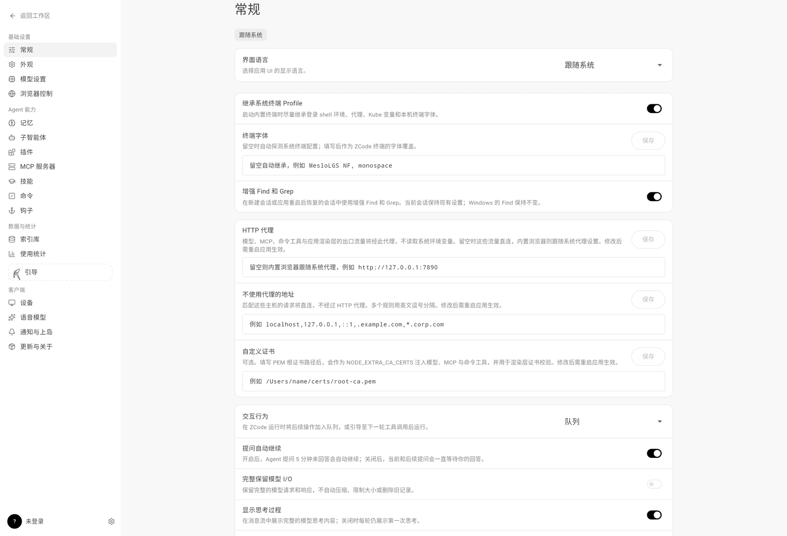
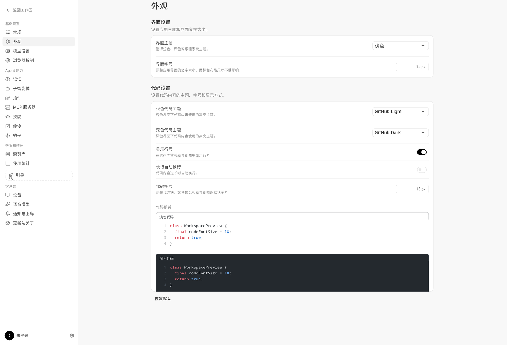
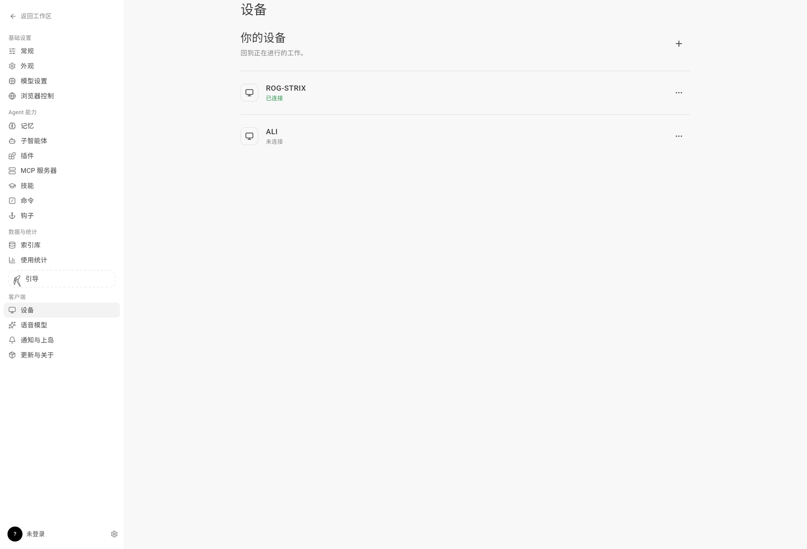
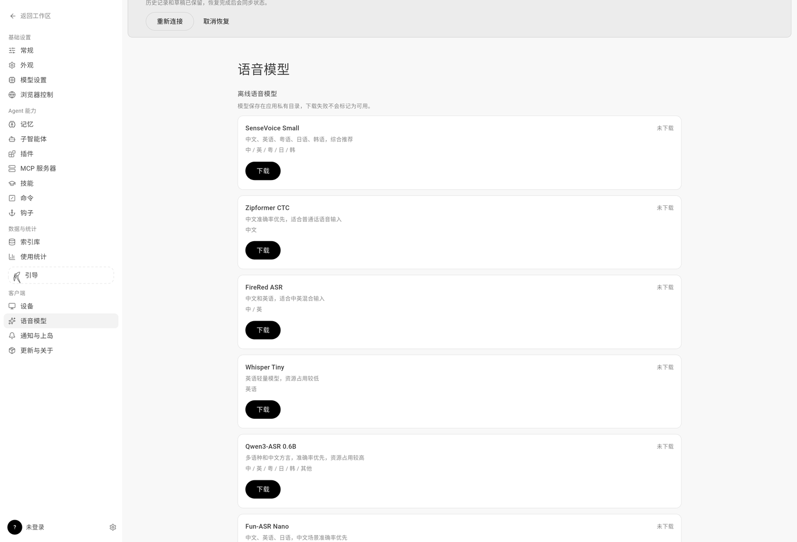
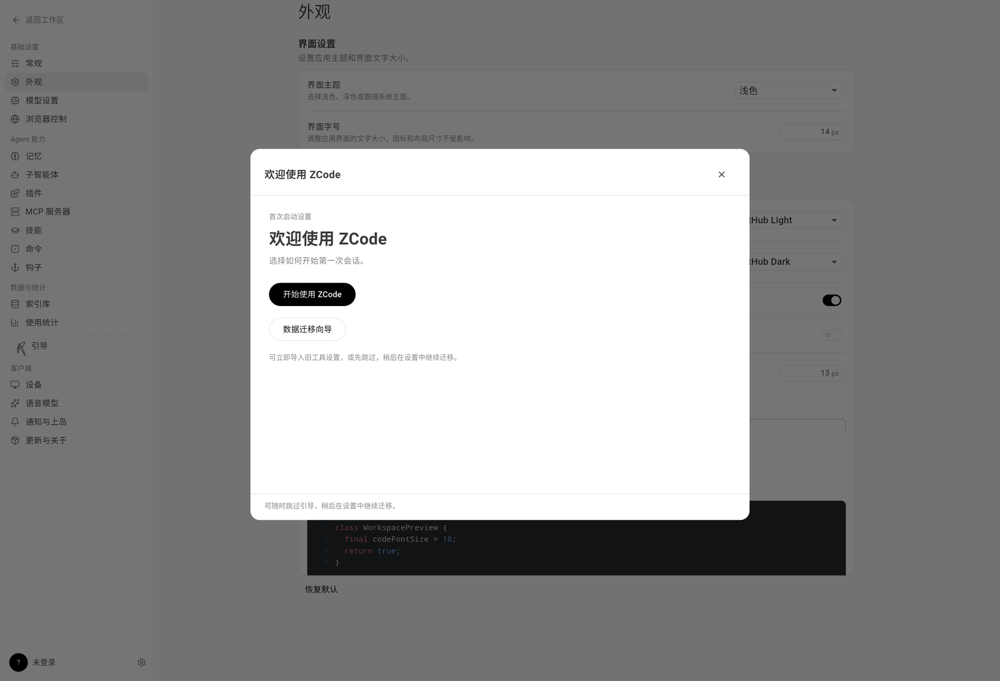
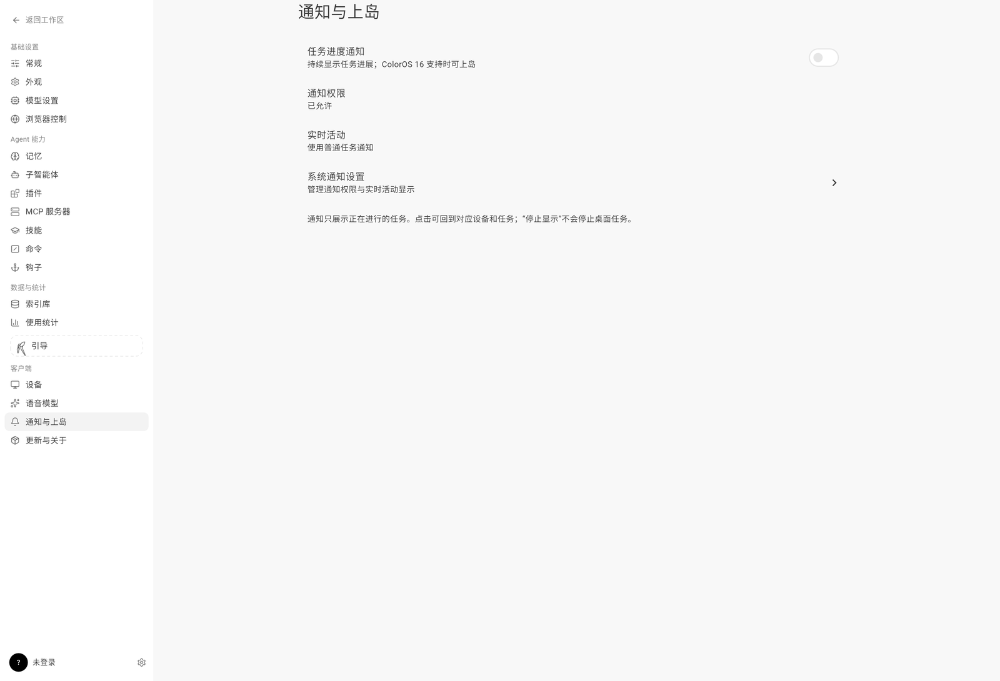

<div align="center">

# ZcodeRemote

**手机/平板上的 ZCode 桌面远程控制客户端**

纯 Flutter 界面 + 纯 Dart 协议栈 + Android 系统能力，对齐官方 Web 客户端体验的 clean-room 复刻实现。

[](https://github.com/ALI2580/zcode_remote/actions/workflows/ci.yml)
[](https://github.com/ALI2580/zcode_remote/actions/workflows/build-apk.yml)


</div>

---

## 这是什么

ZcodeRemote 让你在 Android 手机、折叠屏和平板上远程控制运行 ZCode 的桌面：配对连接、查看与发起任务、阅读回复、审查文件变更、操作终端、语音输入，全部在原生应用内完成。

- **clean-room 复刻**：协议与界面均基于官方 Web 客户端的独立逆向分析从零实现，不包含任何官方客户端代码。
- **非官方项目**：与 Z.ai / ZCode 官方无隶属关系；官方 Web 端仅作为视觉与协议参考。
- **多设备优先**：同时管理多台桌面，连接在页面切换与后台往返间保持存活。

## 界面预览

<div align="center">
  
  
  <p><sub>设置中心 · 官方 max-w-5xl 居中外壳，模型 / 技能 / MCP / 插件 / 命令 / 钩子一站管理</sub></p>
  <p><sub>外观 · 界面主题 + 浅深代码双主题实时预览</sub></p>
  
  
  <p><sub>设备目录 · 多桌面连接状态与最近使用排序 ｜ 语音模型 · 离线 ASR 下载 / 解压 / 校验状态机</sub></p>
  
  
  <p><sub>引导 · 官方风格多步数据迁移向导 ｜ 通知 · ColorOS 16 / Android 16 Live Updates 上岛</sub></p>
</div>

## 功能总览（当前版本 0.1.0+12）

| 领域 | 能力 |
|---|---|
| 连接 | 远程控制链接配对、多设备目录、最近使用排序、连接状态横幅、自动重连 |
| 任务 | 项目/任务侧栏（搜索、置顶、归档、时间线）、会话历史、阅读状态恢复 |
| 对话 | 官方风格工作区外壳（五种布局）、Markdown 渲染、回合分组折叠、工具调用内联 Diff |
| 审查/撤销 | 回合文件变更摘要 → 文件列表 → 右侧红绿 Diff、预检式撤销（rewind） |
| Composer | 附件、@引用、交互模式（含中文本地化）、上下文用量、草稿保留、多任务队列 |
| 设置中心 | 模型供应商/套餐、技能、MCP、插件、命令、钩子、子智能体、外观、统计来源、引导迁移向导 |
| 语音 | 离线 ASR 模型管理（下载进度/解压/校验反馈）、语音输入按钮 |
| Android | 预测性返回、ColorOS 16 / Android 16 Live Updates 上岛、通知点击定位任务、Keystore 凭据加密 |
| 更新 | GitHub Releases 版本检测与应用内下载安装 |

进度与验收的权威追踪见 [references/ui-parity-current-todolist.md](references/ui-parity-current-todolist.md)，变更历史见 [CHANGELOG.md](CHANGELOG.md)。

## 架构

```
lib/
├── protocol/   ★ 纯 Dart 协议栈（无 Flutter 依赖，自底向上）
│   ├── connection_params.dart   远程控制 URL 解析（sid/hash/t）
│   ├── proof.dart               配对证明 HMAC-SHA256
│   ├── relay_client.dart        relay WebSocket + 心跳 + 重连状态机
│   ├── rpc_transport.dart       rpc-frame 分片/重组/CRC32/ack
│   ├── ipc_codec.dart           IPC 值编解码 + 13 字节帧
│   ├── channel_client.dart      channel RPC
│   ├── conversation.dart        Conversation V4 快照 + 增量
│   └── zemote_client.dart       门面：relay → 配对 → bootstrap → bridge → channel
├── state/      多设备会话（DeviceStore / AppSessions）、Composer 状态体系、各设置域控制器
├── ui/         官方风格 ZInk 配色体系、工作区外壳、设置中心、审查面板、终端、语音
├── voice/      离线语音模型存储与下载状态机（Isolate 解压）
└── update/     GitHub Releases 更新检测与 APK 安装
```

分层约束：`protocol` 纯 Dart 可独立测试（120+ 协议测试锚定行为）；`state` 基于 ChangeNotifier/ValueNotifier；`ui` 不直接触达系统接口，Android 能力经 MethodChannel 分层接入。

## 与 Zemote 的关系

本项目**不是 Zemote 的 fork**，而是从零另起炉灶的独立项目。它继承了 Zemote 两个最有价值的资产，其余全部重构：

| 资产 | 处理方式 | 说明 |
|---|---|---|
| `lib/protocol/` | ✅ 照搬 | 纯 Dart 协议栈（relay 配对 / rpc 帧 / Channel / Conversation V4） |
| `references/` | ✅ 照搬 | 官方 Web 客户端逆向知识库（样式规格、协议映射、踩坑记录） |
| `lib/ui/` | 🔧 重构 | 不继承任何旧 UI 代码；按官方样式从零写，无 7000+ 行巨石文件 |
| `lib/state/` | 🔧 重构 | 多设备管理从零设计 |
| `lib/update/` | ✅ 借鉴 | 保留 GitHub Releases 更新检测机制（仓库名参数化为 `updateRepo`） |

## 开发与构建

环境要求：Flutter（Android 平台工具链）、JDK 21、Android SDK。

```bash
flutter pub get

# 静态检查与测试（零告警门槛）
flutter analyze
flutter test

# Debug 包（全 ABI 通用）
flutter build apk --debug

# Release 包（需 android/key.properties 指向签名 keystore）
flutter build apk --release

# 指定单 ABI（模拟器验证/体积优化，注意：Dart AOT 仅含该架构，
# 实体 arm64 机请勿使用 x64 单架构包，否则启动即崩）
flutter build apk --release --target-platform android-x64
flutter build apk --release --target-platform android-arm64
```

产物输出在 `build/app/outputs/flutter-apk/`。

### 版本号三处同步（发版铁律）

1. `pubspec.yaml` 的 `version:`
2. `lib/update/app_version.dart` 的 `appBuildNumber`
3. `test/update/update_checker_test.dart` 的断言

同时更新 [CHANGELOG.md](CHANGELOG.md)，并打 `v*` tag 推送以触发 [Build APK 工作流](.github/workflows/build-apk.yml)。

## 仓库导航

| 路径 | 内容 |
|---|---|
| `references/` | 官方 Web 逆向知识库、验收契约、当前执行清单 |
| `.agents/skills/project-cognition/` | 仓库开发规范与经验沉淀（协议映射、回归方法、发布流程） |
| `test/` | 协议 / 状态 / UI 测试（acceptance-review 系列为逐项验收回归） |
| `integration_test/` | 真机集成验证（IME、语音、旋转隔离、视觉审查） |
| `tooling/` | 协议冒烟与取证脚本 |
| `build/visual-audit/` | 各阶段视觉证据（本地，不入库） |

## 安全与隐私

- 配对凭据（`sid/hash`）在 Android 上经 Keystore AES/GCM 加密落盘，不进入日志、文档与代码。
- 仓库内不提交真实配对链接、签名密钥（`android/key.properties`、`*.jks` 均已 gitignore）与真实账户截图。
- 对真实远端的自动化验证遵循只读取证原则；写入类操作（撤销、迁移、配置修改）仅使用可控假服务测试。

## 许可证

尚未附加开源许可证。如需引用协议分析结论或代码，请先开 issue 联系仓库所有者。
